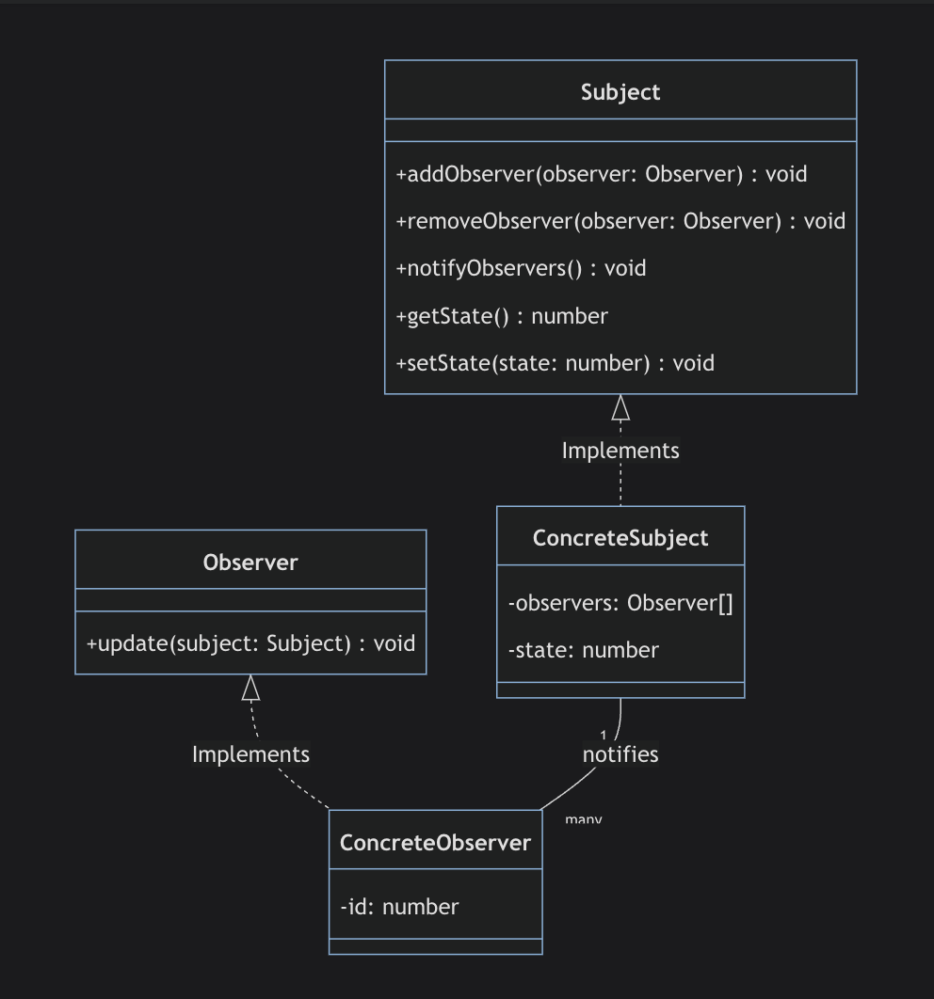

### Introduction To The Observer Pattern
The Observer design pattern is a behavioral design pattern that allows you to define or create a subscription mechanism to send notifications to multiple objects about any new events that happen to the object they're observing. The object that is being watched is often called the subject. The objects that are watching the state changes are called observers or listeners.

### Two most significant elements
Subject: This is the object which is being observed. It maintains a list of observers and provides methods to modify that list.
Observer: The objects which are watching the state changes are known as observers or listeners. They provide a method to update that is used by Subject.

### When To Use The Obsever Pattern
Here are some programming or design "smells" that suggest the Observer pattern would be a good fit as a solution. Here are some code smells or patterns that may lead you to choose the Observer pattern:

1 Polling: If your code is constantly checking or "polling" an object to see if its state has changed, it could benefit from the Observer pattern. Instead of polling, the Observer pattern allows an object to notify other objects directly when its state changes.

2 Inefficient Updates: If an object is being updated too often, or if only some of its observers need to react to changes, yet it's updating all of them anyway, that could be inefficient. The Observer pattern can target specific observers, optimizing the update process.

3 Ineffective Communication Between Objects: If you see objects communicating directly with many other objects to share changes to their internal state, this is a strong smell. This could result in spaghetti code that is difficult to maintain and understand. Implementing the Observer pattern ensures a clean way of communication between objects.

4 High Component Coupling: If components in your system are highly dependent on each other, then changes in one might affect the others. The Observer pattern provides a way to reduce dependencies between your software components.