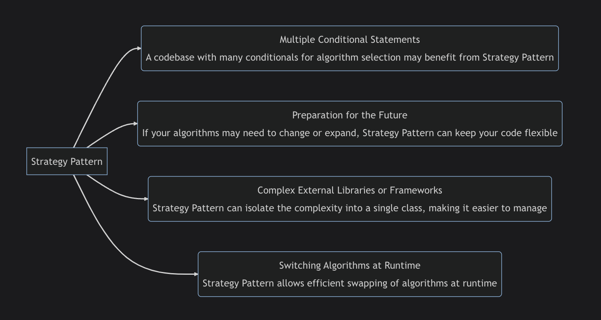

### Introduction To The Strategy Design Pattern
The Strategy pattern is a behavioral design pattern that lets you define a family of algorithms, put each of them into separate classes,
and make their objects interchangeable. 
In other words, it's a way to change the behavior of an object at runtime without changing its implementation.

### When To Use Strategy Pattern
The Strategy pattern isn't something you'd typically apply to a system from the very start of development. More often, 
you'd start using it when the context class gets bloated with massive conditionals that switch the class's behavior depending 
on the values of the fields, parameters, or environment.

