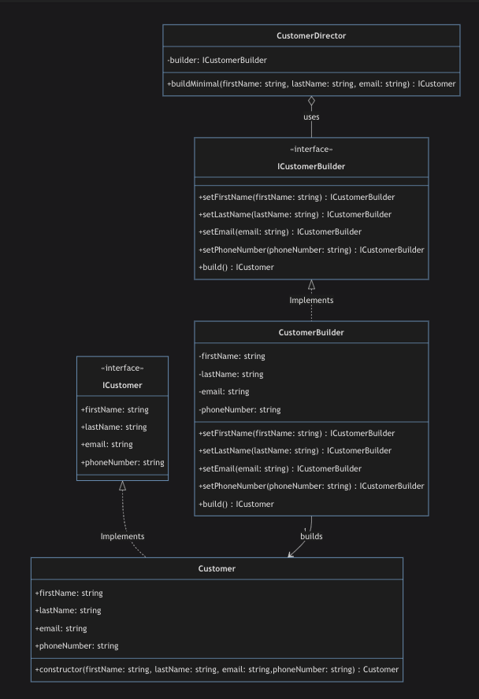

### The Builder Pattern In TypeScript
The Builder pattern is a creational design pattern that lets you construct complex objects STEP BY STEP.

### When To Use The Builder Pattern
The Builder Pattern is typically used to construct a complex object step by step and the same construction process can create different types of objects.

Here are some signs that might indicate that a Builder pattern could be appropriate:

Complex Object Creation: If your software needs to create complex objects that have many attributes, some of which are optional and some are mandatory, the Builder pattern can simplify this process and make your code more readable.

Step-by-step Object Creation: If an object must be created in multiple steps, especially if these steps need to be executed in a specific order, the Builder pattern can be a good fit. It provides a way to ensure the object is always constructed in a valid state.

Combination Explosion: If you are dealing with an object that can be configured in many different ways (such that attempting to provide a constructor for every combination of configurations would be impractical), the Builder pattern can be useful. This is sometimes referred to as the " telescoping constructor" problem.

Constructing Composite Structures: If you need to construct a composite or hierarchical structure (like a tree), a builder can make it easier to understand and maintain the code.

Immutable Objects: If you want to construct an immutable object with many attributes, the Builder pattern can be used to construct the object in steps, and then deliver the final, immutable object.

Code Clarity: If you have a constructor with many parameters and it's not clear what each parameter is for (because they have the same type or aren't self-explanatory), using the Builder pattern can improve code readability. It allows you to set the name of each attribute individually when creating an object.

Remember, design patterns should be used judiciously and where they add value. While the Builder pattern can help in the situations described above, in simpler cases, it might just overcomplicate your code.