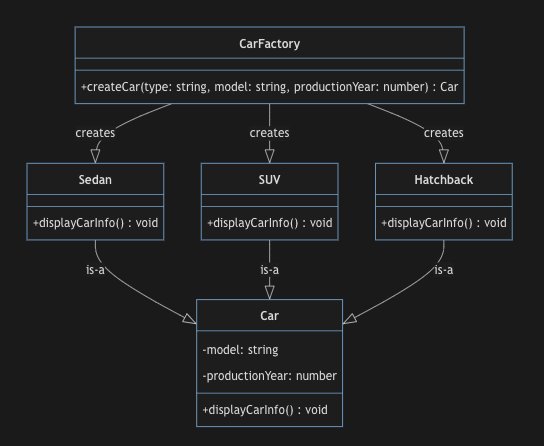
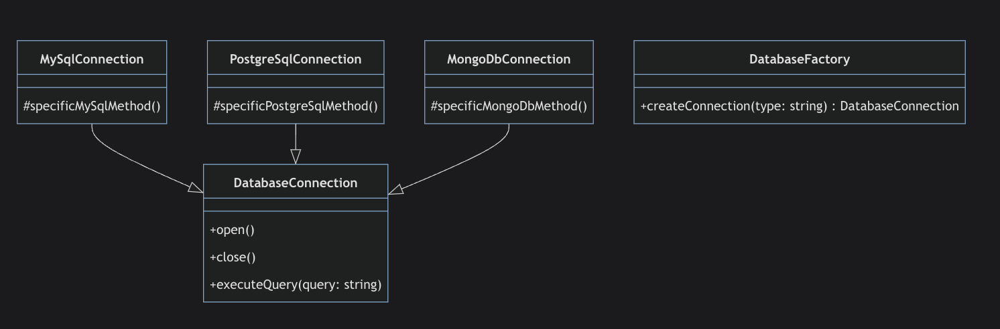
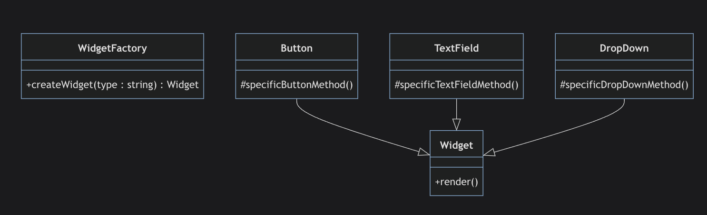

### What's The Factory Pattern 
The Factory Design Pattern is a type of creational design pattern that provides an interface for creating objects in a superclass, but allows subclasses to alter the type of objects that will be created

- Cung cấp 1 interface để tạo ra 1 object ở super class, nhưng cho phép các lớp con thay đổi type / loại của các object được tạo

### When To Use Factory Pattern 
The Factory Method pattern is often used in situations where a class cannot anticipate the type of objects it needs to create.
Here are some signs that might indicate that a Factory Method pattern could be appropriate:
Uncertain Object Types: If your software is supposed to create different types of objects, and you don't know what these objects will be until runtime, you may need a Factory Method.

### Use Cases For Factory Pattern in Application
Here are some real-world scenarios where you might want to use the Factory Pattern:

## Database Connections

Consider an application where you need to support multiple types of databases (like MySQL, PostgreSQL, MongoDB, etc.). Using a factory, you can abstract the creation of database connections. When you want to initiate a connection, you provide the type of database to the factory, and it will create the appropriate connection.

## UI Widget Creation

## Logging
