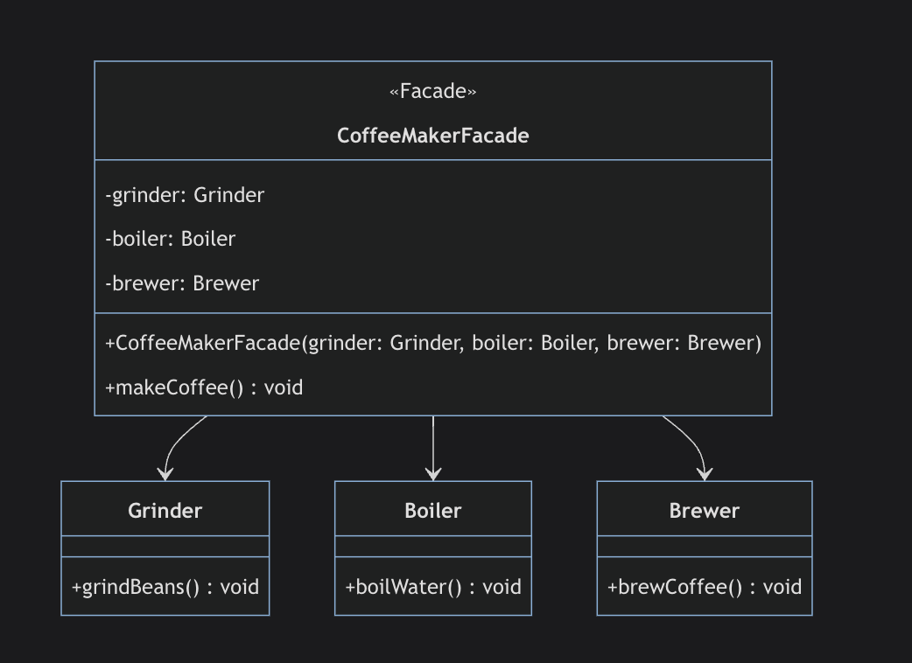

### Introduction To Facade Pattern
The Facade design pattern is a structural design pattern that provides a simplified interface to a complex system. It involves creating a wrapper interface over a complex system to hide its complexities.
 This pattern involves a single class that provides simplified methods required by the client and delegates calls to methods of existing system classes.

 

### When Do You Need The Facade Pattern
1. Rampant Dependencies
    High coupling and complex interactions between classes or subsystems

2. Overwhelming Complexity
Complex subsystems with multiple interdependent classes or operations