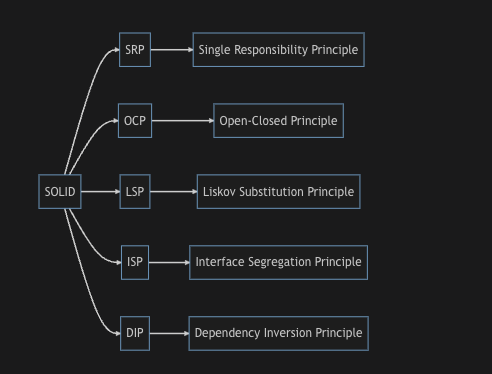

### What are SOLID Design Principles?

SOLID is an acronym that stands for five design principles intended to make software designs more understandable, flexible, and maintainable. These principles were promoted by Robert C. Martin and are widely accepted best practices in software development.

S - Single Responsibility Principle (SRP): This principle states that a class should have one, and only one, reason to change. In other words, a class should have only one job or responsibility. This makes the system easier to manage and reduces the potential of code breaking when changes are made.

O - Open-Closed Principle (OCP): This principle dictates that software entities (classes, modules, functions, etc.) should be open for extension but closed for modification. This means that you should be able to add new features or functionality to a system without altering its existing code. You can extend the behavior of the object, but you should not modify its source code.

L - Liskov Substitution Principle (LSP): This principle suggests that if a program is using a Base class, it should be able to use any of its Subclasses without the program knowing it. Essentially, subclasses must be substitutable for their base classes without affecting the correctness of the program.

I - Interface Segregation Principle (ISP): This principle states that clients should not be forced to depend on interfaces that they do not use. In other words, a class should not have to implement methods it does not use. This principle leads to a system where classes have very specific interfaces and are not overloaded with methods that they don't need.

D - Dependency Inversion Principle (DIP): This principle stresses the need to depend on abstractions, not on concretions. High-level modules should not depend on low-level modules. Both should depend on abstractions. This makes the system more modular, promoting scalability and reducing coupling.

### SOLID vs GoF Design Patterns
Understanding the SOLID principles can certainly help when learning about the Design Patterns promoted by the Gang of Four (GoF), but it's not strictly necessary.

The SOLID principles and the GoF design patterns are both sets of best practices designed to solve common problems in object-oriented software design. They both aim to make software designs more flexible, robust, and maintainable.

The Gang of Four patterns provide concrete solutions to recurring design problems, while the SOLID principles are more abstract and help to guide the overall structure and organization of your code. While you don't need to understand SOLID to learn the GoF patterns, having a grasp of both can make you a more effective and efficient developer.